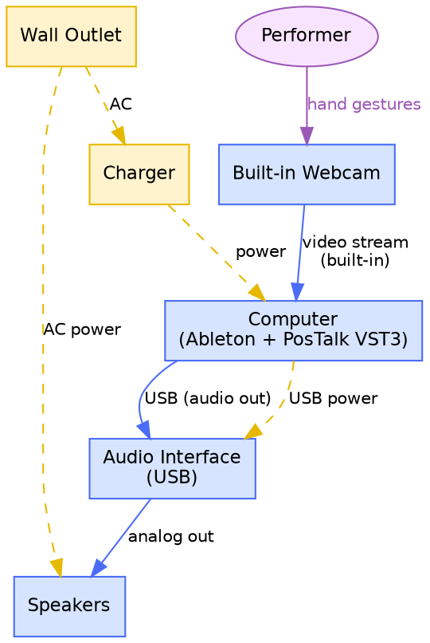

# PosTalk — System Setup

## Overview

PosTalk runs entirely on a single computer. No internet connection is required during performance. The camera feed is processed locally inside the plugin and the resulting gesture data drives DAW parameters in real time.

---

## Components

### Hardware
| Device | Role |
|--------|------|
| Computer | Runs Ableton + PosTalk VST3 |
| Built-in Webcam | Captures hand gestures |
| Audio Interface (USB) | Sends audio to speakers |
| Speakers | Audio output |

### Software
| Component | Role |
|-----------|------|
| Ableton | Audio host |
| PosTalk (VST3) | Gesture tracking and parameter control |

### Internet
Not required at runtime. Only needed to install the plugin.

### Power
| Device | Power Source |
|--------|-------------|
| Computer | Charger (wall outlet) |
| Audio Interface | USB from computer |
| Speakers | Wall outlet |

---

## System Diagram



---

## Signal Flow Summary

```
PERFORMER
    |
    | (hand gestures)
    v
[Built-in Webcam] ──► [Computer: Ableton + PosTalk VST3]
                                      |
                              [Audio Interface]
                                      |
                                 [Speakers]
                                      |
                                    SOUND
```

No external servers. No cloud processing. Everything runs locally on the performer's machine.
